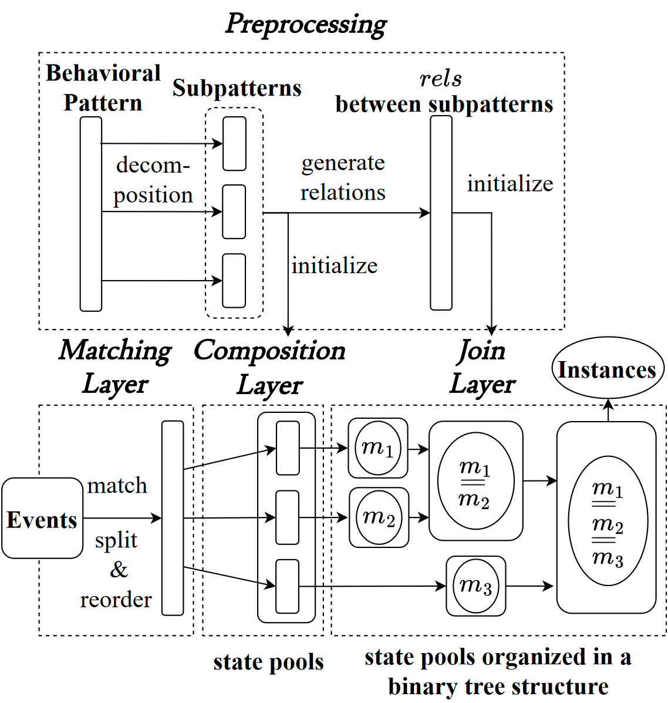

# IPMES

## Overview

- Introduction (2 human-minute)
- Configuration and Installation (1 human-minute, 6 compute-minutes)
	- Dependency (3 compute-minutes)
	- Build IPMES (3 compute-minutes)
- Reproduce and Validate Experiment Results (15 human-minutes, 7 compute-days)
	- Preparation (5 compute-minutes)
	- Matching efficiency (7 compute-days)
	- Window size (5 compute-minutes)
- Execution / How to reuse beyond paper (12 human-minutes, 1 compute-minute)
	- Command-line Syntax
	- Input Graph Format
	- Pattern Format
	- Output and Side Effects
- Authors (1 human-minute)

## Introduction (2 human-minute)

**IPMES** (**I**ncremental Behavioral **P**attern **M**atching Algorithm over the System Audit **E**vent **S**tream for APT Detection) is a system that performs incremental pattern matching over event streams.

The core concept of IPMES involves decomposing a target behavioral pattern into multiple subpatterns, matching events against these subpatterns, and then combining the match results of these subpatterns to generate complete instances. The figure below illustrates an overview of IPMES. Our implementation adopts a layered structure, tailored for efficient streaming data processing. Each layer processes the output of its preceding layer as input. IPMES consists of three layers: **Matching Layer**, **Composition Layer**, and **Join Layer**. A target behavioral pattern is decomposed in **Prepossessing**. Upon reading an event, **Matching Layer** splits it based on its interval timestamps, and reorders events according to their matched event patterns of the subpatterns. Then, the **Composition Layer** uses events to match against subpatterns. Finally, **Join Layer** collects all match results of all subpatterns and merges them into complete instances as outputs.



## Configuration and Installation (1 human-minute, 6 compute-minutes)

### Dependency (3 compute-minutes)

- Java(JDK) >= 11
- Apache Maven >= 3.6.0

Install on Ubuntu/Debian:

```bash
sudo apt-get update
sudo apt-get install openjdk-11-jdk maven
```

### Build IPMES (3 compute-minutes)

With Maven, IPMES can be built with a simple command:

```bash
cd ipmes-java
mvn compile
```

The first build will take longer due to downloading the dependencies.

## Reproduce and Validate Experiment Results (15 human-minutes, 7 compute-days)

This section describes how to reproduce the experiment results in our paper.

### Preparation (5 compute-minutes)

#### Experiment environment

We use Python scripts to automate the experiment. The experiment environment requires:

- RAM >= 100 GB
    - Running experiment on SPADE require 32 ~ 48 GB
    - Running on DARPA require 100 GB
- Unix-like environment (tested on Ubuntu 18.04 and 22.04)
    - GNU bash >= 4.4.20
- Python >= 3.6.9
    - with pip installed
- The Python packages listed in `ipmes-java/requirements.txt` installed

For Ubuntu/Debian:

```
sudo apt-get update
sudo apt-get install python3 python3-pip
cd ipmes-java
pip3 install -r requirements.txt
```

The RAM requirement is high because the experiment involves running IPMES with and without optimizations for comparison. The unoptimized version may need a significant amount of memory to achieve results comparable to the optimized one. However, the optimized IPMES should be runnable on a personal computer with 32 GB of memory.

#### Data Graph

Our experiments use the preprocessed data graph as the input to IPMES. You can download the preprocessed provenance graph for our experiment at [link](https://drive.google.com/file/d/1Iwydm_JaF1p2fls1KXazExIxfnjygUeY/view?usp=sharing).

Extract the file to a location of your choice. In the following example, we assume that the location of preprocessed data graph is located at `<root of source files>/data/preprocessed/`.

```
 unzip preprocessed.zip -d <root of source files>/data/
```

### Matching efficiency (Sec. IV.A, Table IV, Table V) (7 compute-days)

This experiment compares different implementations of IPMES (purposed method, naive method, and CEP) across different patterns on different data graphs.

The following command uses a python script to automate the experiment. The script will output the tables similar to Table IV and Table V in the paper and save the tables to CSV files in `../results/ipmes-java/` (the save path can be changed with `-o` option). For convenience, the script will also print out the command it is currently running.

```shell 
cd ipmes-java
python3 run.py -D all \
    -d ../data/preprocessed/ \
    -o ../results/ipmes-java/
```

example output:

```
Running: bash -c time -p -- mvn -q exec:java -Dexec.args="-w 1800 ../data/universal_patterns/SP1_regex.json ../data/preprocessed/attack.csv "
...
SPADE CPU Time (sec)
             attack  attack-naive  attack-cep        mix    mix-naive    mix-cep    benign  benign-naive  benign-cep
pattern
SP1_regex    8.3500      8.260000   16.260000   9.980000     9.640000  18.950000  6.650000      7.390000     11.4600
SP2_regex    8.4600      9.440000   12.840000   9.240000     9.250000  12.700000  7.060000      6.660000      9.8900
SP3_regex    9.7200     86.960000   18.510000  10.440000    93.010000  20.970000  7.180000      7.470000     12.8400
SP4_regex    9.1200      9.040000   12.760000   9.100000     9.860000  14.530000  7.060000      6.690000      9.8600
SP5_regex    9.1600      9.120000   17.460000  10.480000    10.540000  38.590000  7.730000      7.550000    181.7600
SP6_regex    9.0700      9.430000   14.250000   9.630000    10.570000  17.060000  7.500000      7.220000     11.8400
SP7_regex    8.7700    268.510000   13.810000  11.350000  2827.390000  19.860000  7.610000      7.840000     12.6600
SP8_regex   11.5000     16.460000   15.460000  11.410000    44.070000  16.970000  7.370000     44.110000     15.5700
SP9_regex   10.7300     10.900000   14.740000  11.690000    11.630000  29.160000  7.810000      7.370000     11.9600
SP10_regex  10.1400      9.610000   13.090000  10.400000    10.720000  15.670000  7.460000      7.300000     11.3900
SP11_regex   9.8400     10.810000   13.440000  10.870000    10.420000  16.310000  7.430000      7.620000     11.8500
SP12_regex   8.6300      9.120000   11.790000   9.570000     8.930000  11.810000  7.480000      6.910000      9.8700
Average      9.4575     38.138333   14.534167  10.346667   254.669167  19.381667  7.361667     10.344167     25.9125
This table is saved to ../results/ipmes-java/spade_cpu_time.csv

SPADE Memory Usage (MB)
            attack  attack-naive   attack-cep          mix     mix-naive      mix-cep       benign  benign-naive   benign-cep
pattern
SP1_regex    944.0         768.0  1424.000000  1144.000000   1056.000000  1384.000000   792.000000    776.000000  1536.000000
SP2_regex    968.0        1192.0  1848.000000  1416.000000   1064.000000  1632.000000   792.000000    768.000000  1080.000000
SP3_regex    760.0        4424.0  4816.000000  1520.000000   5360.000000  2336.000000  1016.000000    784.000000  2288.000000
SP4_regex   1032.0        1032.0  1960.000000  1064.000000   1280.000000  2424.000000   744.000000    752.000000  1288.000000
SP5_regex    800.0        1192.0  2032.000000  1232.000000   1360.000000  2448.000000  1536.000000   1504.000000  4696.000000
SP6_regex    752.0        1016.0  2224.000000   768.000000   1192.000000  2096.000000   752.000000   1136.000000  1520.000000
SP7_regex   1192.0       15888.0  1984.000000  1248.000000  22488.000000  2184.000000   808.000000   1104.000000  1528.000000
SP8_regex   1560.0        1552.0  2208.000000  1024.000000   3720.000000  2368.000000   848.000000   1232.000000  1432.000000
SP9_regex   1304.0        1280.0  2416.000000  1424.000000   1784.000000  2272.000000   800.000000    792.000000  2208.000000
SP10_regex  1432.0        1144.0  1696.000000  1056.000000   1176.000000  4688.000000   768.000000    872.000000  1488.000000
SP11_regex  1216.0        1824.0  1576.000000  1152.000000   1104.000000  2288.000000   752.000000    752.000000  2232.000000
SP12_regex  1264.0        1256.0   976.000000  1192.000000   1224.000000  1344.000000   800.000000    792.000000   848.000000
Average     1102.0        2714.0  2096.666667  1186.666667   3567.333333  2288.666667   867.333333    938.666667  1845.333333
This table is saved to ../results/ipmes-java/spade_mem_usage.csv

Running: bash -c time -p -- mvn -q exec:java -Dexec.args="-w 1000 ../data/universal_patterns/DP1_regex.json ../data/preprocessed/dd1.csv "
...
```

The meaning of each output column: `<Dataset Name>[-<IPMES Setting>]`. Available settings:

- When no setting is specified, the default setting is the purposed method in out paper.
- `naive`: naive implementation in the Join layer.
- `cep`: Use CEP tool to implement composition layer.

Note that collecting all the data points may be time-consuming. You can utilize `-D` option of the runner script to specify the dataset (`spade` or `darpa`). The SPADE dataset takes less time to run compared to the DARPA dataset. The following command only runs on the SPADE dataset, and it will output the result similar to Table IV in our paper:

```shell 
python3 run.py -D spade \
    -d ../data/preprocessed/ \
    -o ../results/ipmes-java/
```

If your computer memory is not enough, you can try to apply the `-M` option to set the memory limit of JVM (the script set it to 100 GB by default):

```shell 
python3 run.py -D all\
    -d ../data/preprocessed/ \
    -o ../results/ipmes-java/ \
    -M 48
```

However, this could result in OOM error reported by JVM causing IPMES to exit and may reduce the performance.

### Window size (Sec. IV.B, Fig.6, Fig 7) (5 compute-minutes)

The following command reproduces Fig.6 and Fig.7 in section IV.B of our paper. It will run IPMES to match SP7 on the graph `mix` with different window size options.

```shell 
python3 age_limit_experiment.py \
    -l '2,4,6,8,9,20,40,80,200,400,800,1600,3200,6400,12800,25600,51200' \
    -p ../data/universal_patterns/SP7_regex.json \
    -d ../data/preprocessed/mix.csv
```

example output:

```
WindowSize, AvgCpuTime, PoolSize, NumResults, NumClusters
2        8.62    6981    0       0
4        8.44    2665    5       5
6        8.94    3079    24      12
8        9.57    4100    35      12
9        8.98    4439    38      13
20       9.23    5930    197     13
40       8.85    7034    415     13
80       11.00   13488   1690    13
200      11.33   13932   1690    13
400      12.46   15257   1690    13
800      11.75   16346   1690    13
1600     11.31   16958   1690    13
3200     11.42   29256   1690    13
6400     14.21   40663   1690    13
12800    22.07   64812   1690    13
25600    37.50   130907  1690    13
51200    51.34   235111  1690    13
```

The meaning of each output column:

- `WindowSize`: the window size in seconds.
- `AvgCpuTime`: the CPU Time (in seconds) it took to run on the given configuration.
- `PoolSize`: the maximum number of instances in the pool during matching.
- `NumResults`: the number of match results.
- `NumClusters`: the number of attack cluster. Each cluster represent a single attack behavior.

## Execution / How to reuse beyond paper (12 human-minutes, 1 compute-minute)

### Command-line Syntax

```
usage: ipmes-java [-h] [--dump-trigger-counts] [--dump-results] [-w WINDOWSIZE] [--debug] [--cep] [--naive-join] pattern_file data_graph

IPMES implemented in Java.

positional arguments:
  pattern_file           The path to the pattern, e.g. ../data/universal_patterns/TTP11.json
  data_graph             The path to the preprocessed data graph

named arguments:
  -h, --help             show this help message and exit
  --dump-trigger-counts  Output trigger counts. (default: false)
  --dump-results         Output match results. (default: false)
  -w WINDOWSIZE, --window-size WINDOWSIZE
                         Time window size (sec) when joining. (default: 1800)
  --debug                Output debug information. (default: false)
  --cep                  Use CEP (Siddhi) in composition layer. (default: false)
  --naive-join           Use naive join in join layer. (default: false)

```

Note that running some patterns on large data graphs may require a lot of memory; thus, it is recommended to set the heap allocation limit of JVM to a higher value to avoid OOM error. For example, setting it to 100 GB:

```shell
export MAVEN_OPTS=-Xmx100G
mvn -q exec:java -Dexec.args="-w 1000 ../data/universal_patterns/DP1_regex.json ../data/preprocessed/dd1.csv "
```

In addition, `--cep` and `--naive-join` options are only used for experiment purposes. They result in significant performance degradation, and thus shouldn't be enabled for production use.

### Input Graph Format

Data graphs are in CSV format. The columns in the CSV are: [`start_time`, `end_time`, `event_sig`, `eid`, `start_id`, `end_id`], which represent:

- `start_time`: the event start time
- `end_time`:   the event end time
- `event_sig`:  event signature, a signature is in the format: `{edge label}#{start node label}#{end node label}`
- `eid`:        edge id
- `start_id`:   id of the start node
- `end_id`:     id of the end node

A preprocessed provanence graph can be downloaded at [link](https://drive.google.com/file/d/1Iwydm_JaF1p2fls1KXazExIxfnjygUeY/view?usp=sharing).

### Pattern Format

```json
{
    "Version": "0.1.0",
    "UseRegex": false,
    "Events": [
        {
            "ID": 0,
            "Signature": "aaa",
            "SubjectID": 123,
            "ObjectID": 456,
            "Parents": []
        },
        {
            "ID": 1,
            "Signature": "bbb",
            "SubjectID": 789,
            "ObjectID": 456,
            "Parents": [ 0 ]
        }
    ]
}
```

The pattern is represented in [JSON](https://www.json.org) format. The root object contains 3 keys:

- `Version`: the version of the pattern format, the latest version is `0.1.0`
- `UseRegex`: the `Signature` in this pattern is supposed to be treated as regex expressions. We use [re2j](https://github.com/google/re2j) to handle regex expressions, the supported regex syntax can be found [here](https://github.com/google/re2/wiki/Syntax).
- `Events`: an array of **Pattern Event Object**.

**Pattern Event Object**:

- `ID`: the unique ID of this pattern event
- `Signature`: the signature of this pattern event. It will match input events in the data graph with the same signature. If `UseRegex` is set to `true`, the signature will be treated as a regex expression to match the signatures of input events in the data graph.
- `SubjectID`: the subject of this event. If 2 events arise from the same subject, they share the subject ID.
- `ObjectID`: the object of this event. If 2 events act on the same object, they share the object ID.
- `Parents`: an array of pattern event id. The pattern event should be matched after all of its parents are matched.

Current limitations:

- Pattern event id must be assigned in the range `[0, num_id)`, where `num_id` is the number of unique ids.

See the files in `universal_patterns/` for more information.

### Output and Side Effects

The output of the program is in JSON format. The output will be printed to stdout. To get the match results, you need to turn on the `--dump-results` option.

```
mvn -q exec:java -Dexec.args="-w 1800 ../data/universal_patterns/SP7_regex.json testcase/expect_ttp7.csv --dump-results"
```

The command above will output:

```json
{
  "PeakHeapSize": 522190848,
  "MatchResults": [{
    "EndTime": 1637269341652,
    "StartTime": 1637269279976,
    "MatchIDs": [
      6546604,
      6204163,
      7112806,
      7112865,
      7109083,
      6549533,
      5630794,
      5196484,
      5630793,
      5196483,
      5630795,
      5196481
    ]
  }],
  "NumResults": 1,
  "PeakPoolSize": 11
}
```

The meaning of each key:

- `PeakHeapSize`: the maximum heap allocation size reported by JVM in bytes.
- `MatchResults`: An array of match results, the key of each result:
    - `EndTime`: the timestamp of the latest event of this match instance
    - `StartTime`: the timestamp of the earliest event of this match instance
    - `MatchIDs`: the matched input event IDs, their index in this array corresponds to the pattern event they are matched by. In this example, `6546604` is located in index 0, hence it matches the pattern event with id `0`.
- `NumResults`: the number of match results
- `PeakPoolSize`: the maximum number of instances in the pool
    - This number is meaningless when `--cep` option is enabled since the CEP tool doesn't allow us to obtain the pool size information

## Authors

- Hong-Wei Li (Research Center for Information Technology Innovation, Academia Sinica, Taiwan) <g6_7893000@hotmail.com>
- Ping-Ting Liu (Department of Computer Science, National Yang Ming Chiao Tung University, Taiwan) <xyfc128@gmail.com>
- Bo-Wei Lin (Department of Computer Science, National Yang Ming Chiao Tung University, Taiwan) <0800680274united@gmail.com>
- Yi-Chun Liao (Department of Computer Science and Information Engineering, National Taiwan University, Taiwan) <lyck92@gmail.com>
- Yennun Huang (Research Center for Information Technology Innovation, Academia Sinica, Taiwan) <yennunhuang@citi.sinica.edu.tw>