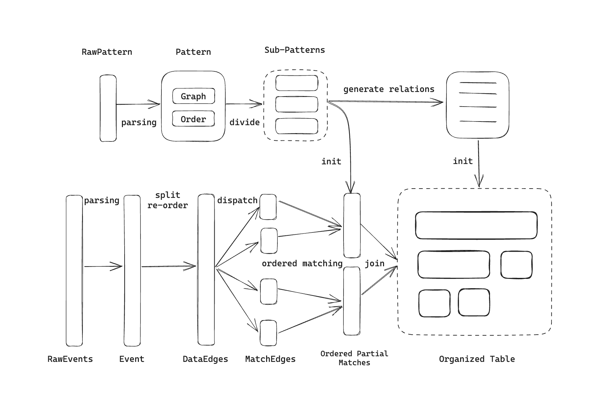

# IPMES

IPMES is a system to perform incremental pattern matching over event streams.

## Description

### Problems

The **Provenance Graph** is a streaming directed graph constructed by system logs. Each event in the log corresponds to an directed edge (arc) in the provenance graph. The points in the provenance graph represent the objects in the system like a file, a process or a network socket. The endpoints of an arc is the object that triggers the event and the object that receives the event respectively. For example, if a process opens a file, there will be an arc from the process to the file and labeled open.

The provenance graph is called streaming sice it is constrcted by event log stream. The graph is given arc-by-arc over time and will keep growing.

The **behavioral pattern** is consists of a graph and a order relation. The graph part of the pattern is similar to the definition of the provenance graph. The order relation specifies the order of some edges in the pattern graph.

The subgraph $G$ of the provenance graph is called **matched subgraph** for a pattern $P$ if:
- there is a bijective function $F$ from $V(G)$ to $V(P)$ such that
    - $uv \in E(G)$ if and ony if $F(u)F(v) \in E(P)$ for all $v \in V(G)$
    - lable of $v$ is the same as the lable of $F(v)$ for all $v \in V(G)$
- the incoming order of the edges in $G$ satisifies the order relations

TL;DR, we are given:
- Provenance Graph
- Behavioral Pattern
	- Graph
	- Order relations

expected output:
- The matched subgraphs


### Input / Output Format

#### Input format for pattern graph

See the example at [TTP11_regex_edge](data/patterns/TTP11_regex_edge.json)

#### Input format for pattern order relations

The oRels file reprensents the order relations of the edges in the pattern.
The file format is a json object like this:

```json
{
    "root": {
        "parents": [],
        "children": [
            0,
            3,
            6
        ]
    },
    "0": {
        "parents": ["root"],
        "children": [2]
    }, ...
}
```

The order relations is expressed in a connected DAG with a root. The root is a virtual vertex, not representing any edge. The other vertices in the graph have a number lable n, corresponding to the n-th edge in the edge file, n starting from 0.

In the DAG, the parents are the dependencies of it's childs, meaning the occurrence of a child must after all of it's parent.

See the example at [TTP11_oRels](data/patterns/TTP11_oRels.json)

#### Input format for provanence graph

In csv format. The columns in the csv: [`start_time`, `end_time`, `event_sig`, `eid`, `start_id`, `end_id`]
- `start_time`: the event start time
- `end_time`:   the event end time
- `event_sig`:  event signature, a signature is in the format: `{edge label}#{start node label}#{end node label}`
- `eid`:        edge id
- `start_id`:   id of the start node
- `end_id`:     id of the end node

You can download the preprocessed provanence graph at [link](https://drive.google.com/file/d/1Iwydm_JaF1p2fls1KXazExIxfnjygUeY/view?usp=sharing)

### Solution
The workflow of **IPMES** is
1. Convert raw input data into DataEdges.
2. **Decompose** the pattern we want to match into TC subqueries (this step is to accelerate matching).
3. Match each TC subqueries separately and store the match results in specific buffers.
4. Decide a strict join order and **join** match results according to it.



#### Decompose:
Event collections without strict timing order would have countless permutations. To avoid it, we decompose patterns without strict timing order into several TC subqueries that have strict timing order.

What is TC Query: https://ieeexplore.ieee.org/document/9248627

#### Join:
When join match result, we need to scan through the whole table we use to store partial match results in order to ensure not missing any possible match. Since the number of partial match results grow explosively, we introduce a new algorithm, Priority Join, to make join more efficient.

Priority Join organize the table, We store diffrient kinds of partial match results in individual buffer. Every time we want to join, we only need to check the partial match results in the corresponding buffer according to the strict join order. This significantly reduce the number of match results we need to check.


## Requirement

- Java >= 11
- Apache Maven >= 3.8.7

## Build from source

```bash
cd ipmes-java/
mvn compile
```

## Running

```bash
mvn exec:java -Dexec.args="[options] data_graph pattern_graph"
```

### Usage

```
usage: ipmes-java [-h] [-r] [--darpa] [-w WINDOWSIZE] [--debug] pattern_prefix data_graph

IPMES implemented in Java.

positional arguments:
  pattern_prefix         The path prefix of pattern's files, e.g. ./data/patterns/TTP11
  data_graph             The path to the preprocessed data graph

named arguments:
  -h, --help             show this help message and exit
  -r, --regex            Explicitly use regex matching. Default will automatically depend on the pattern prefix name (default: false)
  --darpa                We are running on DARPA dataset. (default: false)
  -w WINDOWSIZE, --window-size WINDOWSIZE
                         Time window size (sec) when joining. (default: 1800)
  --debug                Output debug information. (default: false)
```

## Directory Structure

- `data/`: the example input data for the program
    - `patterns/`: the patterns for the SPADE dataset
    - `darpa_pattern/`: the patterns for the DARPA dataset
- `ipmes-python/`: the Python implementation of IPMES which is deprecated now. The files are kept in the repository for data preprocessing.
- `ipmes-java/`: the java implementation for IPMES
    - For a more detailed description of the folder, please read the README in the folder
